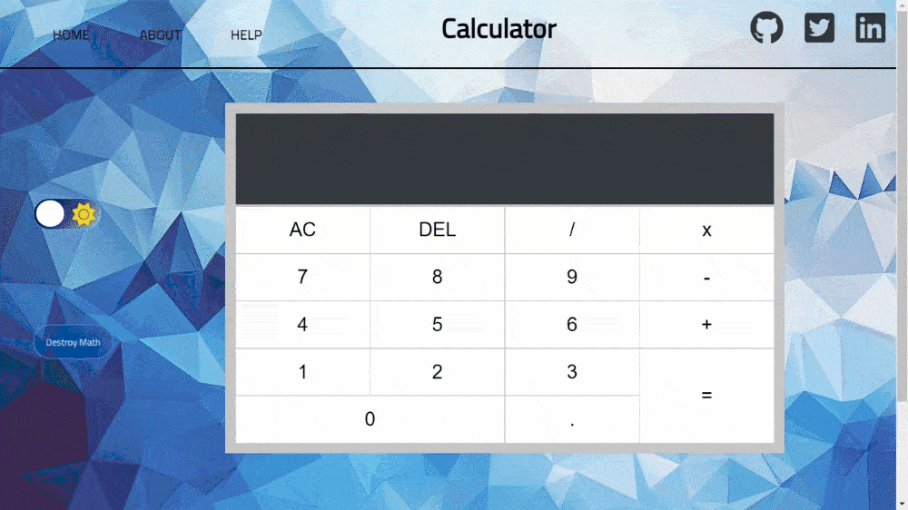
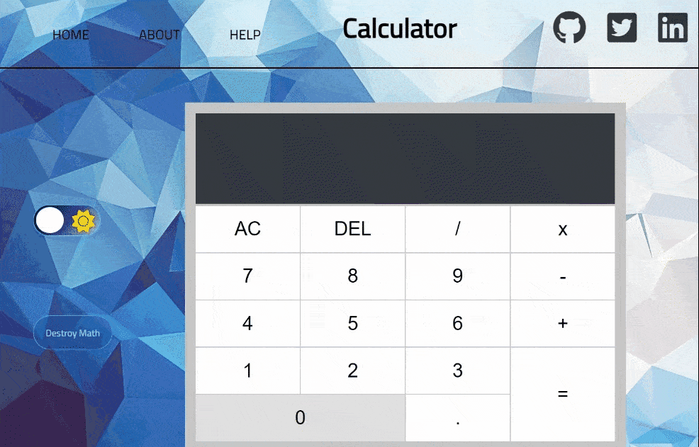

# Why? 🤔
- This a portfolio practice project. I wanted to develop my skills in the areas of SCSS 7-1 file structure, JavaScript, semantic HTML5 content structure. 

---

# Laguages Used 💬
- HTML5
- CSS3
- JavaScript ES6
- SCSS
---

# Features ⚙

## Full calculator functionality
- 

## Dark / light theme toggle
- 

## Destroy math toggle
- 

## Fully responsive
- 
## Laser underline animation
- 

## Entrance and exit animations
-

## Animated hamburger menu with slide-in nav menu
-

---

# What I learned? 👨‍💻

- SCSS 7-1 file structure
- How to add animations using Animate.css
- How to add media queries in SCSS
- How to track a project from start to finish with Git and Github
- Github workflow 
